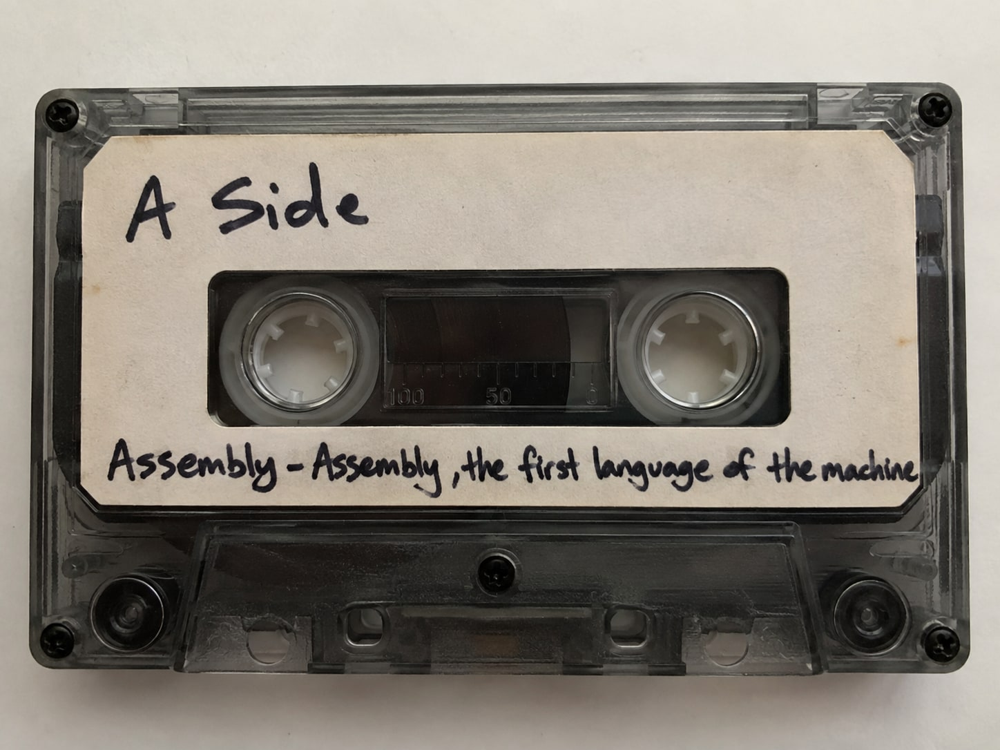
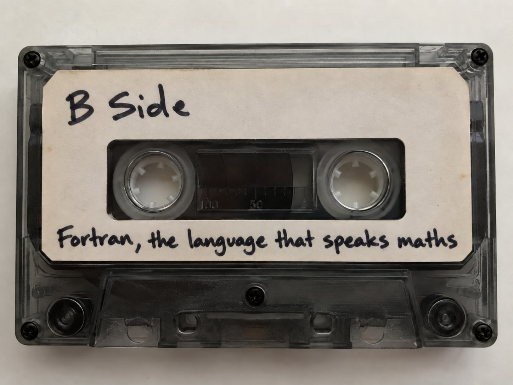

# Start here: you can already read

You can read this page. That skill is the bridge to Assembly and to Fortran. This site treats the two as real languages, with words, grammar and sentences. You do not need to be a programmer to start.

## Two languages, two sides

A cassette tape has two sides. This site has two sides too.

- **A side: Assembly.** This is the first language of the machine. It speaks directly to the processor.

  

- **B side: Fortran.** This language speaks maths. It lets you write formulas that a machine can run.

  

## Your own languages are the model

Think about the languages that you already know.

- Malay is your mother tongue.
- English is your second language, but you think in English.

A machine also has a mother tongue. It is machine code: a stream of numbers. A person cannot read those numbers easily.

**Assembly is machine code in letters.** Each Assembly word matches one machine number. Malay has two scripts: Jawi and Rumi. The words are the same, but the letters are different. Assembly is like Rumi for machine code. The meaning does not change. Only the script changes, so a person can read it.

**Fortran is maths, translated.** The name comes from FORmula TRANslation. You think in maths, as you think in English. A translator program, the compiler, changes your maths into the machine tongue for you.

## The translators

Each side has a translator. The translator is a program that changes your text into machine code.

| | A side: Assembly | B side: Fortran |
|---|---|---|
| Translator | Assembler | Compiler |
| How it translates | One word becomes one machine number | One sentence becomes many machine numbers |
| Like | Changing Rumi letters into Jawi letters | An interpreter who turns an idea into a different language |

## The lens: parts of speech

At school, you learned the parts of speech: verbs, nouns, adjectives. This site uses the same parts for the two languages.

| Part of speech | A side: Assembly | B side: Fortran |
|---|---|---|
| **Verb** (an action) | An instruction, for example `MOV` or `ADD` | A statement, for example `PRINT` or `ALLOCATE` |
| **Noun** (a thing) | A register or a place in memory, for example `AX` | A type of value, for example `INTEGER` or `REAL` |
| **Adjective** (describes a noun) | A size word, for example `BYTE` or `WORD` | An attribute, for example `ALLOCATABLE` |
| **Adverb** (changes a verb) | A prefix, for example `REP` | A loop word, for example `CONCURRENT` |
| **Idiom** (a ready-made phrase) | A BIOS or DOS service call | A built-in function, for example `MATMUL` |
| **Grammar mark** (punctuation) | Commas and `[square brackets]` | Maths signs: `+ - * / **` |
| **Note to the translator** | A directive, for example `ORG` | A structure word, for example `MODULE` |

## The big difference: word count and sentence length

The two dictionaries have very different sizes.

- The A side has a **small dictionary**. The 8086 processor has 81 instructions. Each word does a very small job. Thus, one idea needs a long sentence of many words.
- The B side has a **large dictionary**. Fortran 2018 has 598 keywords, and 275 of them are built-in idioms. One idiom can do a full job. Thus, one idea often fits in one short sentence.

Here is the same idea on the two sides: "Make speed equal to speed plus boost."

```nasm
; A side: three words of work
mov ax, [speed]
add ax, [boost]
mov [speed], ax
```

```fortran
! B side: one sentence
speed = speed + boost
```

## How to use this site

1. Read the [A side overview](/a/) and the [B side overview](/b/).
2. Open one segment, for example "Doing arithmetic". Each segment has an A page and a B page. The two pages show the strengths of each language and the words that it uses.
3. Use the [dictionary](/dictionary/) to look up a word. Filter it by side or by part of speech.
4. Read the [comparison](/compare/) to see the two sides in one table.

## Why the review is here

The site also keeps a review of four documents that an AI (Google Gemini) wrote. The documents helped start the idea. The review found errors and gaps in them. Its purpose is to show areas that you did not think about. You can find it in the "Background research" part of the menu.
